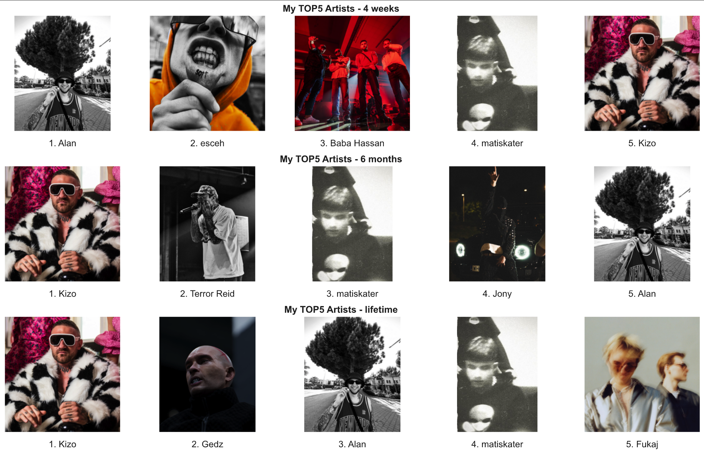
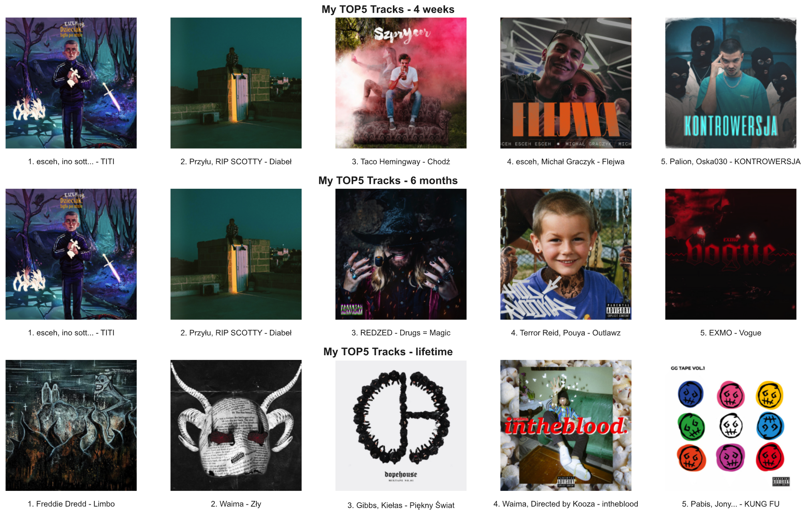
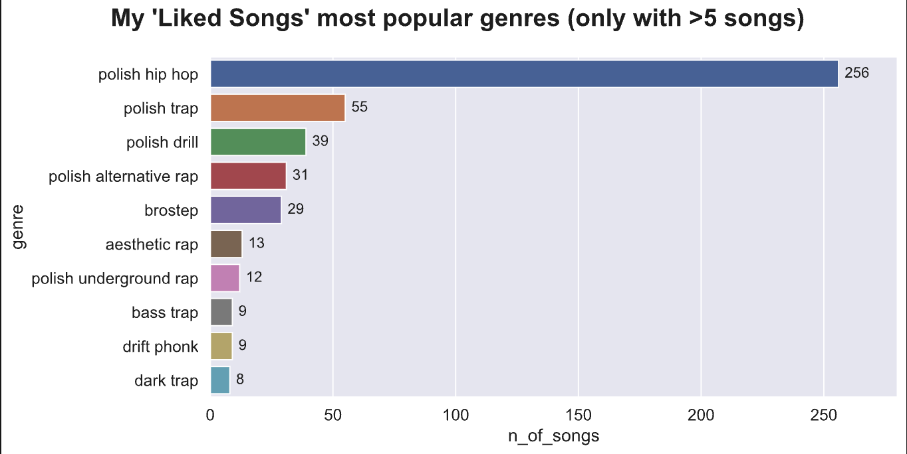
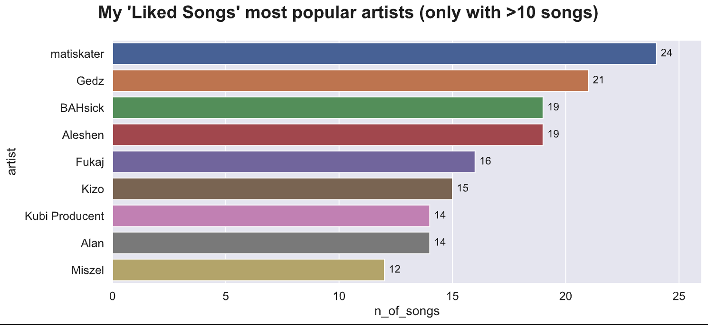
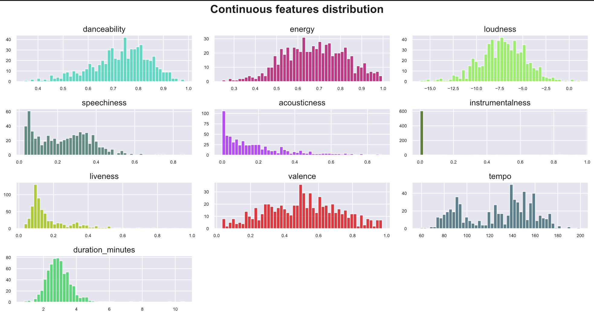
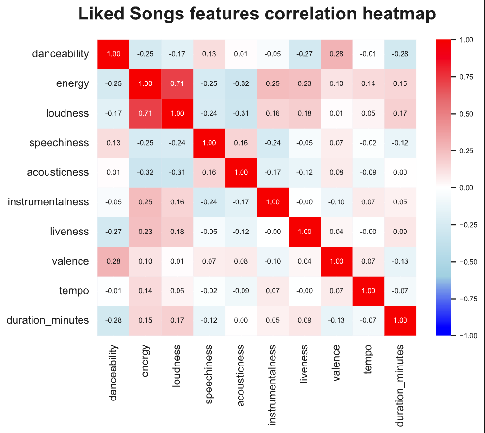
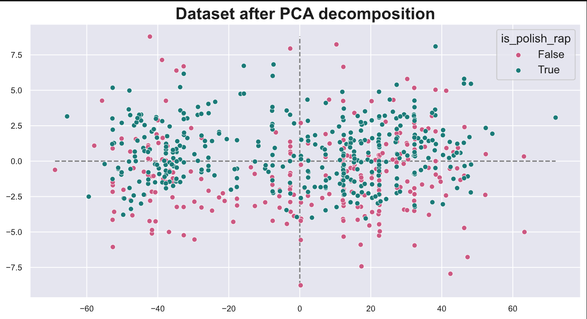
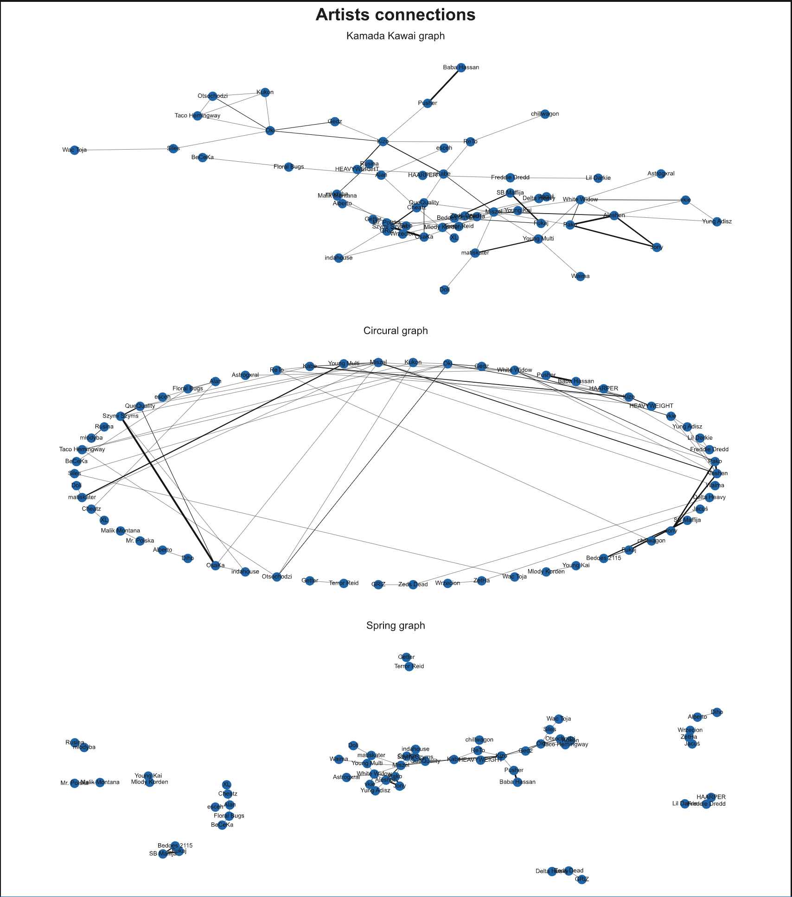

# Personal _Spotify_ data analysis  
## Done: __November 2023__  
___
This is my first big data analysis personal project. I tried coding it in such a way so anybody can download this repo and with some changes, hopefully run the notebook himself.
# __Files description:__  
- `spotipy_credentials.py`: here I was storing my keys and url obtained on [Spotify for Developers](https://developer.spotify.com) website. If you want to run this project, create Developer account on Spotify and paste your credentials there
- `create_datasets.py`: this script connects to your Spotify account using `spotipy` and scraps the data from __Liked Songs__, __TOP50 Poland__ and __TOP50 World__ playlist for later comparsion in the analysis notebook
- `datasets`: in this folder three `.csv` files will be created after `create_datasets.py` script runs successfully
- `project_functions.py`: durning analysis I wrote two big functions and decided to move them to their separate file so the acutal notebook wouldn't be too long to read through
  - one funcion uses `BeautifulSoup` framework to scrap data from website docs, where features generated with `spotipy` are described
  - other function connects to user's Spotify account and creates `matplotlib` plots with so-called "Spotify Wrapped"; it shows user's top 5 most played artists and tracks in three different time periods
- `spotify_analysis_project.ipynb`: actual notebook with the whole analysis and visualizations.

# __About__  
I want my prorfolio to be personal, so this time I decided on analyzing my own __Liked Songs__ Spotify playlist, since I tend to add there all the songs I acutally like.  
# __Goals__  
My goal was simply to explore my main playlist and get better understanding of my music taste in general. I also wanted to check if `spotipy` features are any useful in classification and recomendation.
# __What I've learned__  
- extracting data as dictionaries using API wrapper  
- creating multiple subplots with `matplotlib` and `seaborn`  
- using most common plot types  
- scraping HTML tags with `BeautifulSoup`  
- using Python list and dict comprehensions better  
- filtering Pandas DataFrames  
- creating and plotting simple graphs with `networkx`
- comparing datasets with `cosine similarity`
# __Conclusions__
On my playlist are mostly polish hip-hop tracks with some EDM. Most of my favourite artists either rappers or DJ's/producers. Average song on my playlist is rougly 3 minutes long, is rather 'danceable', has vocals with fast tempo (avg. 136 BPM). `Lil Darkie` has two really loud tracks and the longes one (`GENOCIDE` is above 10 minutes). The default `spotipy` song features aren't very insightful when comparing or classifying songs. They might be used in human-eye analysis. Probably a better way of comparing songs is by using NLP on their lyrics. I might do something like that one day. In my case, the only features correlated with eachother are `energy` and `loudness` (r=.71). With the PCA plot it's obvious that no particular feature determines genre or anything.
# __Visuals__  
## Whole account Mini-Spotify Wrapped  
  
  
## Genres and artists on my playlist  
  
  
## Tracks features  
 
 
## PCA scatterplot  
 
## Artists connections graph on my playlist  
 
